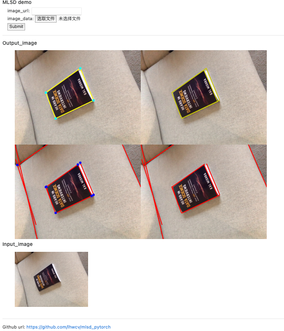

# M-LSD: Towards Light-weight and Real-time Line Segment Detection

### update 2021.07.20

We have push our training code in mlsd_pytorch/

[detail](mlsd_pytorch/README.md)

model| img_size| sAP10
|---|---|:---:| 
mlsd_tiny (this repo)| 512|  56.4
mlsd_tiny (in the paper)| 512|  58.0
mlsd_large (this repo)| 512|  59.6
mlsd_large (in the paper)| 512|  62.1

(this repo use:  min_score=0.05,  min_len=5, tok_k_lines= 500)

---

Pytorch implementation of *"M-LSD: Towards Light-weight and Real-time Line Segment Detection"* <br/>

origin repo:  https://github.com/navervision/mlsd

- [Paper](https://arxiv.org/abs/2106.00186) 
- [PPT](https://www.slideshare.net/ByungSooKo1/towards-lightweight-and-realtime-line-segment-detection)


## Overview
<p float="left">
  
  
</p>


**First figure**: Comparison of M-LSD and existing LSD methods on *GPU*.
**Second figure**: Inference speed and memory usage on *mobile devices*.

## demo



## How to run demo
### Install requirements
```
pip install -r requirements.txt
```

### Run demo

The following demo test line detect (simplest):

```
python demo.py
```

The following demo run with flask in your local: <br/>

```
python demo_MLSD_flask.py
```
you can upload a image the click submit, see what happen.<br/>
http://0.0.0.0:5000/


### Run in docker


Follow the instructions from <https://docs.docker.com/engine/install/ubuntu>,
  <https://github.com/NVIDIA/nvidia-container-runtime#docker-engine-setup> and
  <https://docs.docker.com/compose/install/#install-compose-on-linux-systems> to setup your environment.

- Build the image

```
docker-compose build

```

- Run the demo

```
docker-compose up

```

- Run the flask demo

```
docker-compose -f docker-compose.yml -f docker-compose.flask.yml up

```

### TensorRT/ Jetson Device Support

#### Prerequisites

Go ahead and complete installation of NVIDIA's torch2trt library with the following [instructions](https://github.com/NVIDIA-AI-IOT/torch2trt), ensuring that a compatible CUDA compiled torch wheel is available first. For instance:

```
#Jetpack 4.6.1
export TORCH_INSTALL=https://developer.download.nvidia.com/compute/redist/jp/v461/pytorch/torch-1.11.0a0+17540c5+nv22.01-cp36-cp36m-linux_aarch64.whl

python3 -m pip install --upgrade pip; python3 -m pip install expecttest xmlrunner hypothesis aiohttp numpy=='1.19.4' pyyaml scipy=='1.5.3' ninja cython typing_extensions protobuf; export "LD_LIBRARY_PATH=/usr/lib/llvm-8/lib:$LD_LIBRARY_PATH"; python3 -m pip install --upgrade protobuf; python3 -m pip install --no-cache $TORCH_INSTALL

```

#### Usage

For simple usage go ahead and dial in the following:

```
python trt_converter.py --model tiny --conversion fp16 --bench
```
All model locations default to `./models/mlsd_{model_type}__512_trt_{conversion}.pth`.
The tool also supports int8 conversion provided that a representative subset of images is is provided as follows:

```
python trt_converter.py --model tiny --conversion int8 --calibration_data calib-folder
```

**Note** You may also convert each torch2trt wrapped representation to a standard serialized engine for use with native TensorRT with both the --engine and --serialize arguments.

#### Benchmarks

Device| Raw FPS| Speed (ms)
|---|---|:---:| 
Xavier NX - FP16| 134 |  7.35
Xavier NX - int8| 238 |  4.13
AGX Xavier - FP16 | 280 |  3.53
AGX Xavier - int8 | 451 |  2.18


*Tested on a Xavier NX Developer Kit(Jetpack 5.0.1 - developer preview), and an AGX Xavier Developer Kit (Jetpack 4.6.1)


## Citation
If you find *M-LSD* useful in your project, please consider to cite the following paper.

```
@misc{gu2021realtime,
    title={Towards Real-time and Light-weight Line Segment Detection},
    author={Geonmo Gu and Byungsoo Ko and SeoungHyun Go and Sung-Hyun Lee and Jingeun Lee and Minchul Shin},
    year={2021},
    eprint={2106.00186},
    archivePrefix={arXiv},
    primaryClass={cs.CV}
}
```

## License
```
Copyright 2021-present NAVER Corp.

Licensed under the Apache License, Version 2.0 (the "License");
you may not use this file except in compliance with the License.
You may obtain a copy of the License at

    http://www.apache.org/licenses/LICENSE-2.0

Unless required by applicable law or agreed to in writing, software
distributed under the License is distributed on an "AS IS" BASIS,
WITHOUT WARRANTIES OR CONDITIONS OF ANY KIND, either express or implied.
See the License for the specific language governing permissions and
limitations under the License.
```
